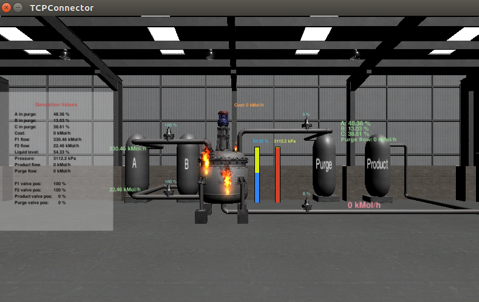
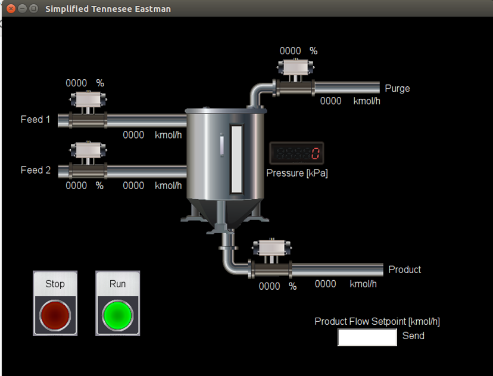

# GRFICS
GRFICS is a graphical realism framework for industrial control simulations that uses Unity 3D game engine graphics to lower the barrier to entry for industrial control system security. GRFICS provides users with a full virtual industrial control system (ICS) network to practice common attacks including command injection, man-in-the-middle, and buffer overflows, and visually see the impact of their attacks in the 3D visualization. Users can also practice their defensive skills by properly segmenting the network with strong firewall rules, or writing intrusion detection rules.

GRFICS was originally developed by researchers from [Fortiphyd Logic](https://fortiphyd.com) and the [Georgia Institute of Technology](http://cap.ece.gatech.edu) with the goal of bringing practical ICS security skills to a wider audience. We kindly ask that any derivations or publications resulting from the use of GRFICS provide a citation for this GitHub respository and the workshop paper we published about the framework:

Formby, D., Rad, M., and Beyah, R. Lowering the Barriers to Industrial Control System Security with GRFICS. In *2018 USENIX Workshop on Advances in Security Eductation (ASE 18)*. https://www.usenix.org/conference/ase18/presentation/formby

### Overview

The current version of GRFICS is organized as 3 VirtualBox VMs (a 3D simulation, a soft PLC, and an HMI) communicating with each other on a host-only virtual network. For a more detailed explanation of the entire framework and some background information on ICS networks, please refer to the workshop paper located at [https://www.usenix.org/conference/ase18/presentation/formby]

### Simulation

The simulation VM runs a realistic simulation of a chemical process reaction that is controlled and monitored by simulated remote IO devices through a simple JSON API. These remote IO devices are then monitored and controlled by the PLC VM using the Modbus protocol.

### Programmable Logic Controller

The PLC VM is a modified version of OpenPLC ([https://github.com/thiagoralves/OpenPLC_v2]) that uses an older version of the libmodbus library with known buffer overflow vulnerabilities. 

### Human Machine Interface

The HMI VM primarily contains an operator HMI created using the free AdvancedHMI ([https://www.advancedhmi.com]) software. This HMI is used to monitor the process measurements being collected by the PLC and send commands to the PLC.

In addition to the HMI, this VM also contains the PLCOpenEditor software used to reprogram the OpenPLC.

### Instructions

Recommended hardware:
25GB free hard drive space
8GB RAM
Quad core processor

1. Download and install the latest version of VirtualBox from https://www.virtualbox.org/wiki/Downloads

2. Create a host-only interface in VirtualBox (https://www.virtualbox.org/manual/ch06.html#network_hostonly)

3. Download an image for both the desktop and server versions of 64-bit Ubuntu 16.04 from http://releases.ubuntu.com/16.04/

4. See instructions for each VM in corresponding directories